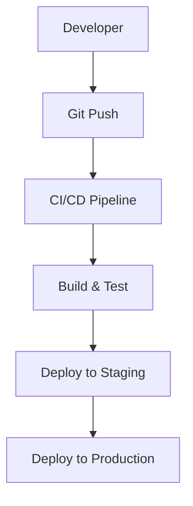

# Outils Essentiels pour Cloud Engineers

Maîtriser les bons outils est crucial pour une carrière réussie dans le cloud. Voici les outils indispensables organisés par catégorie.

## Command Line & Shell

### Terminal Modern
**Starship** - Prompt shell ultra-rapide et personnalisable
```bash
# Installation
curl -sS https://starship.rs/install.sh | sh

# Configuration ~/.config/starship.toml
[directory]
truncation_length = 3
truncate_to_repo = false
```

**Oh My Zsh** - Framework pour shell Zsh
```bash
# Installation
sh -c "$(curl -fsSL https://raw.github.com/ohmyzsh/ohmyzsh/master/tools/install.sh)"

# Plugins recommandés
plugins=(git docker kubectl terraform aws)
```

### Gestionnaires de Paquets
- **Homebrew** (macOS/Linux) : `brew install <package>`
- **Chocolatey** (Windows) : `choco install <package>`
- **apt/yum** (Linux) : Gestionnaires système

## Cloud CLI Tools

### AWS CLI
```bash
# Installation
curl "https://awscli.amazonaws.com/awscli-exe-linux-x86_64.zip" -o "awscliv2.zip"
unzip awscliv2.zip
sudo ./aws/install

# Configuration
aws configure
```

### Azure CLI
```bash
# Installation
curl -sL https://aka.ms/InstallAzureCLIDeb | sudo bash

# Login
az login
```

### Google Cloud CLI
```bash
# Installation
curl https://sdk.cloud.google.com | bash

# Initialisation
gcloud init
```

## Infrastructure as Code

### Terraform
**Le standard pour IaC multi-cloud**

```hcl
# Configuration basique
terraform {
  required_providers {
    aws = {
      source  = "hashicorp/aws"
      version = "~> 5.0"
    }
  }
}

provider "aws" {
  region = var.aws_region
}
```

**Outils complémentaires :**
- **tfenv** : Gestionnaire de versions Terraform
- **terraform-docs** : Documentation automatique
- **tflint** : Linter pour Terraform

### Pulumi
**IaC avec des langages de programmation**
```python
import pulumi
import pulumi_aws as aws

# Créer un bucket S3
bucket = aws.s3.Bucket("my-bucket",
    versioning=aws.s3.BucketVersioningArgs(
        enabled=True,
    ))
```

### CloudFormation / ARM Templates
- **AWS CloudFormation** : IaC natif AWS
- **Azure ARM Templates** : IaC natif Azure
- **Google Cloud Deployment Manager** : IaC natif GCP

## Containerisation & Orchestration

### Docker
```dockerfile
# Dockerfile basique
FROM node:18-alpine
WORKDIR /app
COPY package*.json ./
RUN npm install
COPY . .
EXPOSE 3000
CMD ["npm", "start"]
```

**Outils Docker utiles :**
- **Docker Compose** : Applications multi-containers
- **Dive** : Analyse des layers d'images
- **Portainer** : Interface web pour Docker

### Kubernetes
```yaml
# Déploiement basique
apiVersion: apps/v1
kind: Deployment
metadata:
  name: app-deployment
spec:
  replicas: 3
  selector:
    matchLabels:
      app: myapp
  template:
    metadata:
      labels:
        app: myapp
    spec:
      containers:
      - name: app
        image: myapp:latest
        ports:
        - containerPort: 8080
```

**Outils Kubernetes essentiels :**
- **kubectl** : CLI officiel Kubernetes
- **Helm** : Gestionnaire de packages K8s
- **k9s** : Interface terminal pour K8s
- **kubectx/kubens** : Changement de contexte rapide

## CI/CD & Automation

### GitHub Actions
```yaml
# .github/workflows/ci.yml
name: CI/CD Pipeline
on:
  push:
    branches: [ main ]
  pull_request:
    branches: [ main ]

jobs:
  test:
    runs-on: ubuntu-latest
    steps:
    - uses: actions/checkout@v3
    - name: Run tests
      run: npm test
    
  deploy:
    needs: test
    runs-on: ubuntu-latest
    if: github.ref == 'refs/heads/main'
    steps:
    - name: Deploy to production
      run: echo "Deploying..."
```

### Jenkins
- **Pipeline as Code** avec Jenkinsfile
- **Blue Ocean** : Interface moderne
- **Plugins** : Écosystème riche

### GitLab CI
```yaml
# .gitlab-ci.yml
stages:
  - build
  - test
  - deploy

build_job:
  stage: build
  script:
    - echo "Building..."

test_job:
  stage: test
  script:
    - echo "Testing..."

deploy_job:
  stage: deploy
  script:
    - echo "Deploying..."
  only:
    - main
```

## Monitoring & Observability

### Prometheus + Grafana
```yaml
# prometheus.yml
global:
  scrape_interval: 15s

scrape_configs:
  - job_name: 'prometheus'
    static_configs:
      - targets: ['localhost:9090']
  
  - job_name: 'app'
    static_configs:
      - targets: ['app:8080']
```

### ELK Stack (Elasticsearch, Logstash, Kibana)
- **Elasticsearch** : Moteur de recherche
- **Logstash** : Ingestion et transformation
- **Kibana** : Visualisation

### Outils Cloud-Native
- **AWS CloudWatch** : Monitoring AWS
- **Azure Monitor** : Monitoring Azure
- **Google Cloud Operations** : Monitoring GCP

## Sécurité & Secrets Management

### HashiCorp Vault
```bash
# Démarrage du serveur dev
vault server -dev

# Stockage d'un secret
vault kv put secret/myapp/config username=admin password=secret
```

### AWS Secrets Manager / Azure Key Vault
```bash
# AWS Secrets Manager
aws secretsmanager create-secret \
    --name MySecret \
    --secret-string '{"username":"admin","password":"secret"}'

# Azure Key Vault
az keyvault secret set \
    --vault-name MyKeyVault \
    --name MySecret \
    --value "secret-value"
```

### Sécurité Statique
- **Checkov** : Analyse de sécurité IaC
- **Terrascan** : Scanner de sécurité
- **SonarQube** : Qualité et sécurité du code

## Éditeurs & IDE

### VS Code
**Extensions essentielles :**
- **Terraform** : Syntax highlighting et validation
- **Docker** : Gestion des containers
- **Kubernetes** : Outils K8s intégrés
- **AWS Toolkit** : Intégration AWS
- **Azure Tools** : Intégration Azure
- **Git Graph** : Visualisation git

### Configuration recommandée
```json
{
  "editor.formatOnSave": true,
  "terraform.format.enable": true,
  "docker.truncateLongRegistryPaths": true,
  "kubernetes.vs-code-api-version": "v1"
}
```

## Productivity Tools

### Documentation
- **Notion** : Documentation collaborative
- **Obsidian** : Notes liées et knowledge base
- **GitBook** : Documentation technique

### Diagrammes
- **Draw.io** : Diagrammes techniques
- **Lucidchart** : Diagrammes professionnels
- **Mermaid** : Diagrammes as code



### Communication
- **Slack** : Communication d'équipe
- **Discord** : Communautés techniques
- **Microsoft Teams** : Collaboration d'entreprise

## Langages & Scripting

### Python
```python
# Exemple avec boto3 (AWS SDK)
import boto3

s3 = boto3.client('s3')
response = s3.list_buckets()

for bucket in response['Buckets']:
    print(f"Bucket: {bucket['Name']}")
```

### Bash/Shell
```bash
#!/bin/bash
# Script de déploiement
set -e

echo "Déploiement en cours..."
docker build -t myapp .
docker push myapp:latest
kubectl apply -f deployment.yaml
echo "Déploiement terminé !"
```

### Go
```go
// Exemple d'API simple
package main

import (
    "fmt"
    "net/http"
)

func main() {
    http.HandleFunc("/", handler)
    http.ListenAndServe(":8080", nil)
}

func handler(w http.ResponseWriter, r *http.Request) {
    fmt.Fprintf(w, "Hello, Cloud World!")
}
```

## Conseils d'Utilisation

### Automatisation
1. **Automatisez tout** ce qui peut l'être
2. **Scripting** pour les tâches répétitives
3. **Templates** pour les configurations communes
4. **Aliases** pour les commandes fréquentes

### Organisation
1. **Dotfiles** : Versionner vos configurations
2. **Workspaces** : Séparer les environnements
3. **Documentation** : Documenter vos processus
4. **Backup** : Sauvegarder vos configurations

### Apprentissage Continu
1. **Labs pratiques** : Expérimenter avec les outils
2. **Projets personnels** : Appliquer les connaissances
3. **Communautés** : Partager et apprendre
4. **Veille technologique** : Rester à jour

---

*La maîtrise des outils ne fait pas tout, mais elle vous permet de vous concentrer sur la résolution de problèmes plutôt que sur les détails techniques.* 